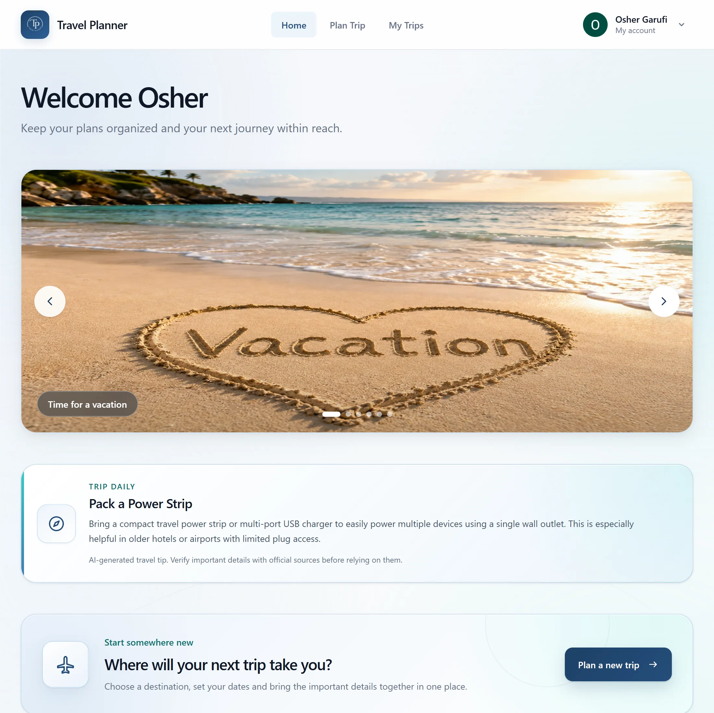
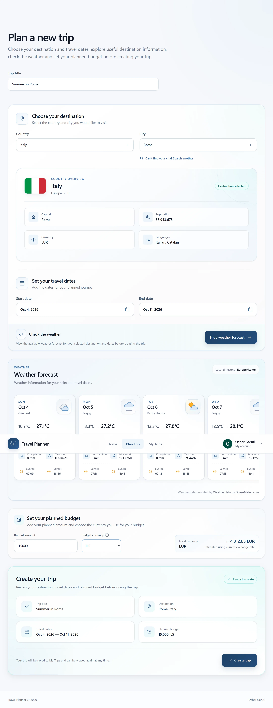
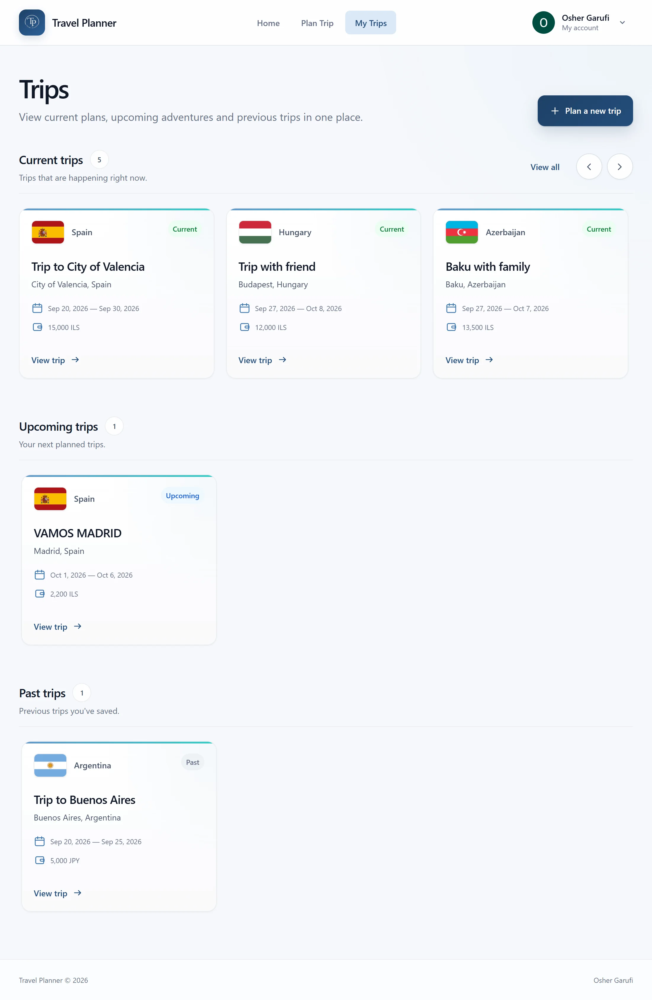
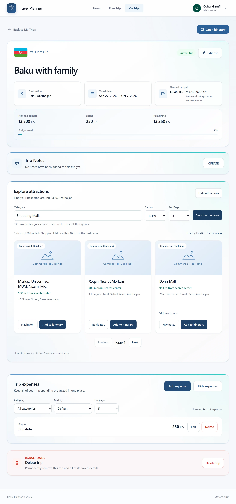
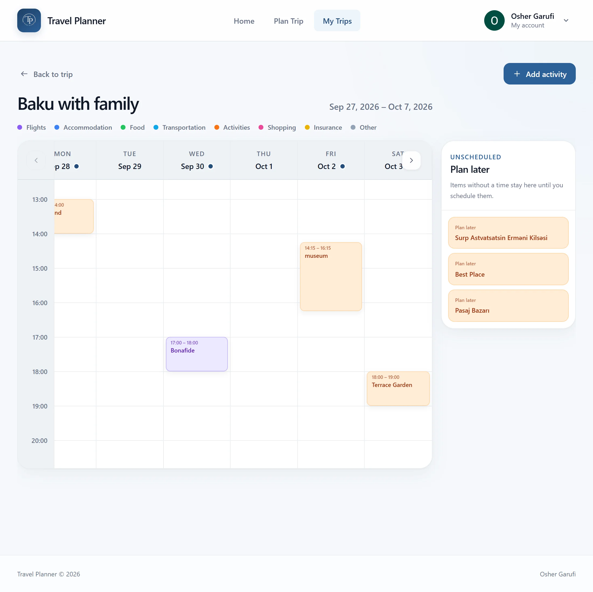
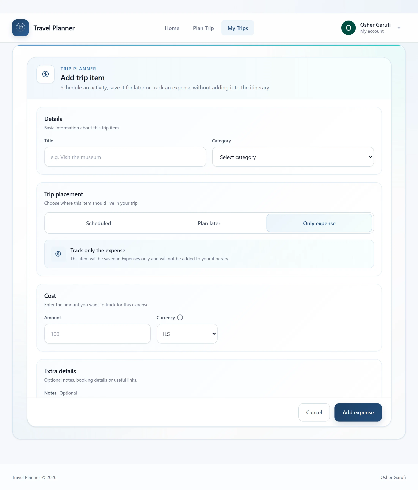
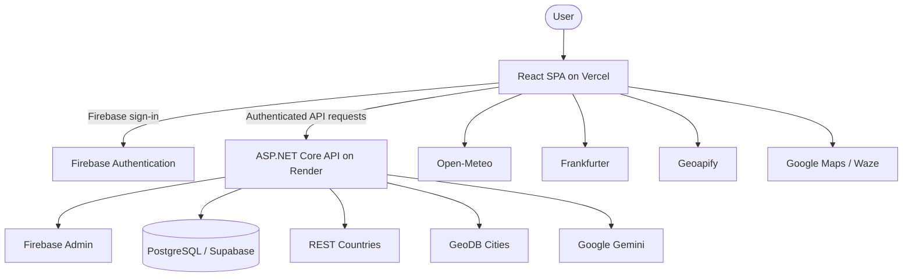

# Travel Planner

Travel Planner is an authenticated full-stack web application for planning and managing trips. It brings destination research, itinerary scheduling, expense tracking, attraction discovery, weather information, currency conversion, and AI-assisted travel features into one responsive workspace.

**[Live Demo](https://project-travel-planner.vercel.app)**

Built with React 19 and Vite 8 on the frontend, an ASP.NET Core 9 Web API on the backend, PostgreSQL on Supabase, and Firebase Authentication.



## Key Features

- **Authentication and trip management:** Google and email/password authentication through Firebase, verified-email registration, full trip CRUD, and current/upcoming/past trip organization.
- **Destination planning:** Country and city discovery, destination overview information, forecast and historical weather, planned budgets, and currency conversion.
- **Itinerary and expenses:** Week-based scheduling, unscheduled “Plan Later” activities, standalone expenses, optionally linked itinerary expenses, and supported transitions between free and paid activities.
- **Attraction discovery:** Nearby place search, an Add to Itinerary flow, and outbound navigation through Google Maps and Waze.
- **AI assistance:** Gemini-powered daily travel tips and trip-note organization while keeping final edits under user control.
- **Responsive experience:** Purpose-built desktop, tablet, and mobile layouts.

## Product Tour

### Plan Trip

Choose a country and city, review destination information, select travel dates, check available weather, compare the planned budget with the local currency, and create the trip through one guided flow.



### Trips

Saved trips are organized into current, upcoming, and previous journeys for quick access.



### Trip Details

The trip workspace combines the travel summary, budget progress, editable notes, attraction discovery, and expense management.



### Itinerary

Activities can be scheduled across the trip week or kept in a Plan Later collection until their timing is decided.



### Add Trip Item

One entry flow supports scheduled activities, Plan Later activities, and expense-only records, including activities with an associated cost.



## Tech Stack

| Area | Technologies |
|---|---|
| Frontend | React 19, JavaScript, Vite 8, React Router 7, Firebase Web SDK, responsive CSS |
| Backend | ASP.NET Core 9 Web API, C#, Firebase Admin SDK, Npgsql, parameterized SQL, `IMemoryCache`, Google Gen AI SDK |
| Database | PostgreSQL hosted on Supabase |
| Deployment | Vercel, Docker, Render, Supabase, Firebase Authentication |

The backend uses handwritten, parameterized SQL through Npgsql rather than an ORM.

## Architecture

The React SPA communicates with the ASP.NET Core API for authenticated application data, ownership enforcement, persistence, country and city data, and AI operations. Public browser-oriented providers are called directly by the frontend where that matches the current integration.



Detailed documentation:

- [System Architecture](docs/architecture/system-architecture.md)
- [Data Flow](docs/architecture/data-flow.md)
- [Data Model](docs/architecture/data-model.md)
- [Authentication Flow](docs/architecture/authentication.md)

## Engineering Highlights

- User-owned trips, itinerary items, and expenses are resolved through the authenticated local user and scoped at the data-access layer.
- All PostgreSQL access uses parameterized SQL; linked itinerary and expense workflows use transactions to keep both records consistent.
- Trip-date changes reconcile scheduled itinerary items with the updated date range.
- Request cancellation, stale-response guards, and selected in-flight request sharing prevent obsolete or duplicate provider work.
- Browser memory, `sessionStorage`, user-scoped `localStorage`, backend memory caching, and persistent daily-tip storage are used according to data lifetime.
- Itinerary schedule changes use optimistic persistence with reconciliation against confirmed backend state.
- The frontend is organized around feature pages, hooks, services, request managers, contexts, and reusable presentation components.
- AI-generated daily tips are persisted by date and can be reused as a fallback across backend restarts.

## Authentication and Ownership

Firebase handles browser authentication through Google and email/password providers. Email/password registration includes email verification before normal sign-in.

The frontend sends Firebase ID tokens to the ASP.NET Core API. Firebase Admin verifies the identity, which is mapped to a local PostgreSQL user record. The resulting local user UUID scopes access to trips and, through their parent trip, itinerary items and expenses. Client-supplied resource identifiers alone do not establish ownership.

See [Authentication Flow](docs/architecture/authentication.md) for the current lifecycle and ownership model.

## External Integrations

| Integration | Layer | Purpose |
|---|---|---|
| Firebase Authentication | Browser | Google and email/password authentication, session management, and ID tokens |
| Firebase Admin | Backend | ID-token verification and trusted Firebase identity extraction |
| Supabase / PostgreSQL | Backend | Persistent application data and transactional workflows |
| Google Gemini | Backend | Daily travel tips and trip-note organization |
| REST Countries | Backend | Country metadata |
| GeoDB Cities | Backend | Major-city discovery and city search |
| Open-Meteo | Browser | Forecast and historical weather |
| Frankfurter | Browser | Exchange rates and currency conversion |
| Geoapify | Browser | Attraction categories and nearby-place discovery |
| Google Maps / Waze | Browser | Outbound map and navigation links |

## API Overview

The REST API is organized into six areas:

| Area | Responsibility |
|---|---|
| Authentication | Verify a Firebase token and synchronize the local user |
| Destinations | Return country metadata, major cities, and city-search results |
| Trips | Create, read, update, and delete trips; organize note drafts with Gemini |
| Itinerary | Manage activities and schedule-only updates |
| Expenses | Manage expenses and linked expense/activity transitions |
| Home | Return the cached, persisted, or generated daily travel tip |

See the [complete API overview](docs/api/overview.md) for routes, validation, ownership rules, and status-code behavior.

## Data Model

The PostgreSQL schema contains five application tables:

- `users`
- `trips`
- `trip_expenses`
- `trip_itinerary_items`
- `daily_travel_tips`

A user owns many trips, and each trip owns its itinerary items and expenses. An itinerary item may optionally reference one expense, allowing a paid activity to appear consistently in both planning and expense views. Backend transactions coordinate operations that modify linked itinerary and expense records.

See the [Data Model](docs/architecture/data-model.md) for the entity relationships, constraints, indexes, and persistence details.

## Local Development

### Prerequisites

- Node.js and npm
- .NET 9 SDK
- PostgreSQL database
- Firebase project with web and Admin SDK configuration
- REST Countries and Gemini API credentials
- Optional restricted Geoapify browser key for attraction discovery

### Setup

1. Clone the repository:

   ```bash
   git clone https://github.com/OsherGarufi/Project--Travel-Planner.git
   cd Project--Travel-Planner
   ```

2. Create a PostgreSQL database and execute [Backend/Database/schema.sql](Backend/Database/schema.sql). With Supabase, the schema can be run through its SQL editor.

3. Configure the backend using [Backend/appsettings.Example.json](Backend/appsettings.Example.json) as the reference. Supply secrets through ASP.NET Core configuration, environment variables, or .NET user secrets rather than committing them.

4. Create `Frontend/.env` from [Frontend/.env.example](Frontend/.env.example) and provide the required browser configuration.

5. Install frontend dependencies:

   ```bash
   cd Frontend
   npm install
   ```

6. From the repository root, start the backend:

   ```bash
   dotnet run --project Backend/Backend.csproj
   ```

7. In a separate terminal, start the frontend:

   ```bash
   cd Frontend
   npm run dev
   ```

The default development URLs are `http://localhost:5223` for the backend and `http://localhost:5173` for Vite.

## Configuration

### Frontend

[Frontend/.env.example](Frontend/.env.example) documents:

- `VITE_API_BASE_URL`
- `VITE_FIREBASE_API_KEY`
- `VITE_FIREBASE_AUTH_DOMAIN`
- `VITE_FIREBASE_PROJECT_ID`
- `VITE_FIREBASE_STORAGE_BUCKET`
- `VITE_FIREBASE_MESSAGING_SENDER_ID`
- `VITE_FIREBASE_APP_ID`
- `VITE_GEOAPIFY_API_KEY`

All `VITE_*` values are embedded in browser code and must be treated as public client configuration. Browser-visible provider keys should use the provider’s origin or referrer restrictions. Geoapify is optional unless attraction discovery is required.

### Backend

[Backend/appsettings.Example.json](Backend/appsettings.Example.json) describes the expected PostgreSQL connection string, Firebase Admin credentials path, allowed CORS origins, REST Countries API key, and Gemini model/API configuration. Server credentials must remain outside source control.

## Project Structure

```text
Backend/
  Controllers/       HTTP routes and response handling
  DAL/               Parameterized PostgreSQL access
  Dtos/              Request and response contracts
  Models/            Persisted application records
  Services/          Business workflows and provider integrations
  Database/          Current PostgreSQL schema
  Dockerfile         Backend container build

Frontend/
  src/
    components/      Feature and presentation components
    pages/           Route-level screens
    hooks/           Feature workflows and state coordination
    services/        API clients, provider clients, caches and request managers
    context/         Authentication, trips and feedback state
    config/          Firebase client configuration
    css/             Shared and feature styling
  vercel.json        SPA deployment rewrite

docs/
  architecture/      System, flow, model and authentication documentation
  api/               Backend API reference
  screenshots/       Portfolio product screenshots
```

## Deployment

- **Frontend:** Vite production build deployed on Vercel — [open the live application](https://project-travel-planner.vercel.app).
- **Backend:** ASP.NET Core API built as a multi-stage Docker image and deployed on Render.
- **Database:** PostgreSQL hosted on Supabase.
- **Authentication:** Firebase Authentication in the browser with Firebase Admin verification on the backend.

## Future Improvements

- Add automated backend integration tests and browser end-to-end coverage.
- Introduce versioned database migration tooling.
- Centralize backend authentication and authorization through ASP.NET Core middleware and policies.
- Add distributed caching for multi-instance deployments.

## Documentation

- [System Architecture](docs/architecture/system-architecture.md)
- [Data Flow](docs/architecture/data-flow.md)
- [Data Model](docs/architecture/data-model.md)
- [Authentication Flow](docs/architecture/authentication.md)
- [API Overview](docs/api/overview.md)
