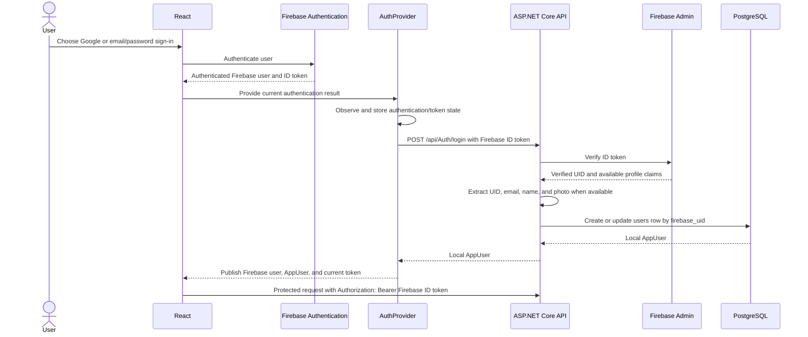
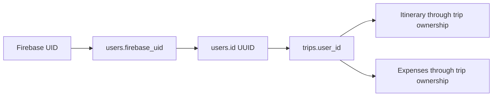

# Travel Planner — Authentication and Authorization

## 1. Overview

Firebase Authentication is Travel Planner's external identity provider. The application supports Google sign-in and email/password registration and login. Firebase ID tokens identify authenticated users when the frontend communicates with the backend.

The backend maintains a separate local `users` table. A unique Firebase UID maps the external Firebase identity to a local application UUID in `users.id`. That local UUID—not the Firebase UID—is the ownership key used by trips and, through their parent trip, itinerary items and expenses.

## 2. Authentication Architecture Diagram



The token shown in the diagram is a placeholder. No application documentation or source-controlled configuration contains a real user token.

## 3. Google Sign-In

Google sign-in uses Firebase's popup flow and requests explicit account selection. Firebase authenticates the selected Google identity and returns a Firebase user. The frontend obtains that user's Firebase ID token and calls the backend login/synchronization endpoint.

After verifying the token, the backend synchronizes the Firebase UID, email, display name, and photo URL into the local `users` table when those profile claims are available. The application then uses the current Firebase ID token on protected API requests.

## 4. Email/Password Registration

The current email/password registration flow is:

1. Firebase creates the user from the submitted email and password.
2. The frontend updates the Firebase profile with the submitted display name.
3. Firebase sends a verification email.
4. The frontend signs the new user out.
5. The user must verify the email before the normal email/password login flow proceeds.

After an email/password sign-in, the frontend checks Firebase's `emailVerified` value. If the email is not verified, it signs the user out and reports that verification is required. Email verification is therefore currently enforced by the frontend login flow; the backend does not independently enforce an email-verification claim.

## 5. Session Restoration and Token Refresh

`AuthProvider` subscribes to Firebase's `onIdTokenChanged` event. When Firebase restores an existing session after a page reload or supplies a refreshed token, the provider obtains the current ID token, synchronizes the Firebase user with the backend when appropriate, and replaces the authentication state held by React.

Protected frontend services receive and send the current token rather than retaining a separate long-lived copy. Session and request-generation guards prevent results from an older authentication session from updating the current user's state.

Logout signs out of Firebase, clears the Firebase user, local `AppUser`, and token from React state, and removes or invalidates user-scoped trip, itinerary, expense, and attraction caches. Switching between users also clears private cache data associated with the previous account.

## 6. Backend Token Verification

The protected request path is:

```text
React
  → Authorization: Bearer <Firebase ID token>
  → Controller
  → CurrentUserService
  → FirebaseAuthService
  → Firebase Admin
  → verified Firebase UID
  → local users lookup
  → AppUser
```

`CurrentUserService` accesses the current HTTP request through `IHttpContextAccessor`. It reads the `Authorization` header, requires the `Bearer` format, extracts the token, and passes it to `FirebaseAuthService`. `FirebaseAuthService` verifies the ID token with Firebase Admin and returns the decoded Firebase token. `CurrentUserService` then resolves the verified UID through `users.firebase_uid` and returns the corresponding local `AppUser` to the controller.

A missing header, malformed Bearer value, empty token, failed verification, or missing local user results in no current `AppUser`. Protected controllers treat that outcome as unauthorized before performing application operations.

The current backend does not use ASP.NET Core authentication middleware or `[Authorize]` attributes for these endpoints. Authentication is enforced explicitly by the protected controller actions through `CurrentUserService`.

## 7. Local User Mapping



The Firebase UID identifies the account in the external identity system. `users.firebase_uid` stores the unique mapping to the application's internal `users.id` UUID. Business data uses this internal UUID: trips reference it through `trips.user_id`, while itinerary items and expenses inherit ownership through their required trip relationship.

This separation lets Firebase remain responsible for identity while PostgreSQL maintains stable application relationships and ownership.

## 8. Ownership Enforcement

### Trips

Trip queries and mutations are scoped by the resolved local user ID. Reads, updates, and deletes use both the trip identifier and `users.id`; trip creation records that same local UUID as `trips.user_id`.

### Itinerary

Itinerary ownership is validated through the parent trip. Backend services and DAL queries join or filter through the trip and require its `user_id` to match the current local user before returning or changing an item.

### Expenses

Expense ownership is also validated through the parent trip. Reads, updates, transitions, and deletions use the current local user ID in ownership-aware DAL or service operations.

Knowing another trip, itinerary-item, or expense UUID is not sufficient to access it. Resources outside the current user's ownership scope generally remain unavailable and are handled as not found. Ownership enforcement is implemented by backend controllers, services, DAL operations, and parameterized SQL. The schema enables PostgreSQL row-level security but defines no RLS policies, so RLS is not the current application ownership boundary.

## 9. Public vs Authenticated API Boundary

| Area | Authentication |
|---|---|
| Auth login/sync | Public bootstrap endpoint; verifies the Firebase token supplied in the request body. |
| Destinations | Public. |
| Daily travel tip | Public. |
| Trips | Authenticated through controller use of `CurrentUserService`. |
| Itinerary | Authenticated through controller use of `CurrentUserService`. |
| Expenses | Authenticated through controller use of `CurrentUserService`. |
| Trip note organization | Authenticated and subject to trip ownership validation. |

Public endpoints do not resolve a current local user. The login endpoint is public at the HTTP routing level because it bootstraps the local user, but it still verifies the submitted Firebase ID token before synchronizing any record.

## 10. Security Characteristics

- Firebase Admin performs server-side verification of Firebase ID tokens.
- Protected frontend requests transport the current ID token in the HTTP Bearer header.
- The local `users.id` UUID forms the application ownership boundary.
- Controllers and business services pass that local UUID to ownership-aware data operations.
- Npgsql commands use parameterized SQL.
- Client-provided user IDs are not trusted to establish resource ownership.
- Private frontend caches are scoped by Firebase user where applicable.
- Logout and user switching clear or invalidate private cached data.
- Database, Gemini, and Firebase Admin secrets remain server-side.
- Firebase web configuration is browser-visible by design and is not treated as a private server secret.
- The Geoapify key is also browser-visible and depends on provider-side origin or referrer restrictions.
- Firebase Admin credentials remain outside source control.

The current Firebase Admin verification call validates the supplied ID token, but the application does not request Firebase's additional token-revocation check.

## 11. Authentication Responsibilities by Layer

| Layer | Responsibility |
|---|---|
| Firebase Authentication | Authenticates Google and email/password identities, maintains the Firebase session, and issues ID tokens. |
| React / `AuthProvider` | Coordinates sign-in state, backend user synchronization, token refresh handling, logout, and private-cache cleanup. |
| Frontend API client | Adds the current Firebase ID token as a Bearer header when a protected service supplies it. |
| ASP.NET controllers | Invoke current-user resolution for protected actions and reject requests without a resolved local user. |
| `CurrentUserService` | Parses the Bearer header, requests token verification, and resolves the local `AppUser`. |
| `FirebaseAuthService` | Wraps Firebase Admin ID-token verification and returns the decoded Firebase token. |
| DAL / services | Apply the local user UUID to ownership-aware queries and transactional business operations. |
| PostgreSQL | Stores the Firebase-to-local-user mapping and enforces relational integrity for user-owned data. |
