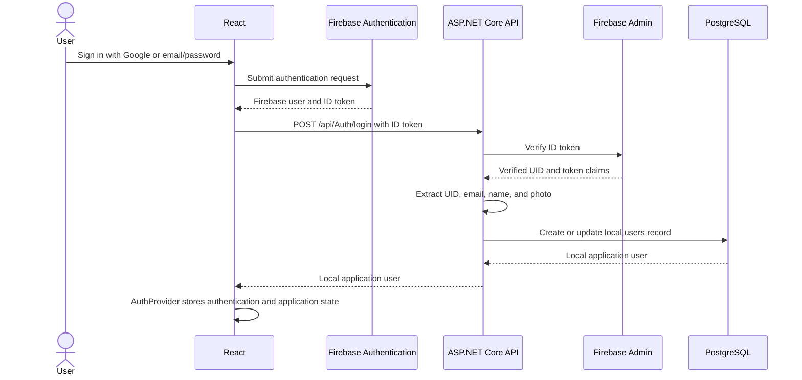
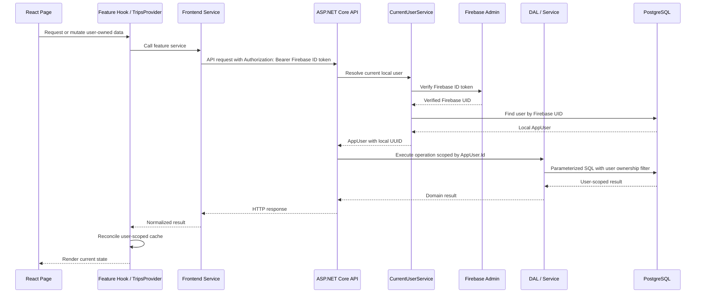
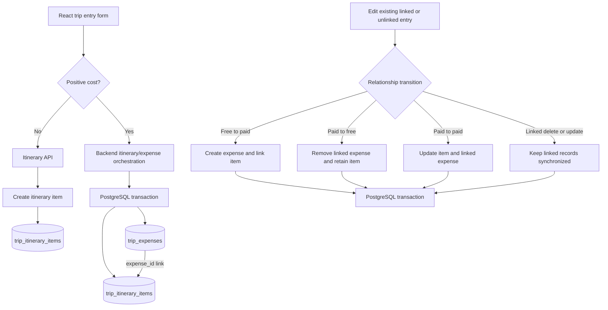
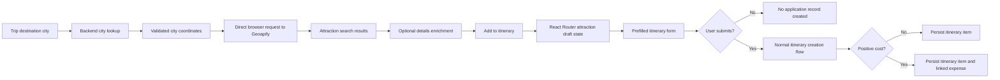
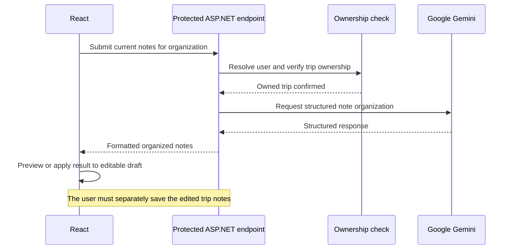
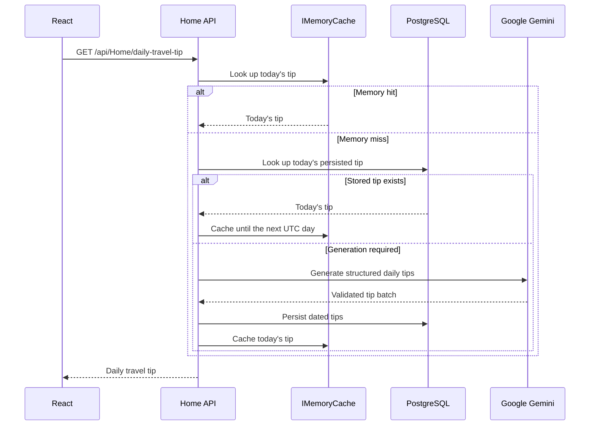
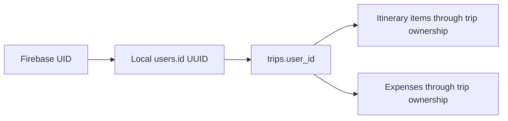

# Travel Planner — Data Flow

## 1. Overview

Travel Planner has several distinct data paths rather than one universal request flow. Authentication, user-owned data, trip planning, itinerary and expense synchronization, attractions, and AI features each cross different application boundaries. Some public-data providers are accessed directly by the browser, while protected data, persistence, ownership checks, and AI operations pass through the ASP.NET Core API.

## 2. Authentication and Local User Synchronization

`AuthProvider` subscribes to Firebase's `onIdTokenChanged` event. This restores authenticated sessions after a page load and repeats backend synchronization when Firebase supplies a refreshed token. The backend verifies the supplied token directly through Firebase Admin; this flow does not use ASP.NET authentication middleware or `[Authorize]`.

## 3. Authenticated Trip Data Flow

The local `AppUser.Id` is carried into database and business-service operations. This same ownership pattern protects trip reads and mutations, itinerary operations, and expense operations. Resource queries include the owning user—directly or through the trip relationship—rather than trusting a resource identifier supplied by the browser on its own.

## 4. Trip Creation Flow

Countries and cities are requested through backend destination endpoints. Weather forecasts and historical data are fetched directly from Open-Meteo by the browser. Currency rates are fetched directly from Frankfurter by the browser. The completed trip payload is then sent to the protected backend endpoint, persisted under the local user's ID, added to the `TripsProvider` state and cache, and used to open the new trip's details view.

## 5. Itinerary and Expense Synchronization

A free activity creates only an itinerary item. An activity with a positive cost is handled by backend orchestration that creates the expense and itinerary item in one transaction and stores the relationship through `trip_itinerary_items.expense_id`.

The same orchestration supports free-to-paid, paid-to-free, and paid-to-paid transitions. Updates and deletions involving linked records are coordinated so the activity and expense do not drift apart. Operations affecting both tables use PostgreSQL transactions and roll back when the combined operation cannot complete.

## 6. Attractions Flow

The frontend first calls the backend city-search endpoint to resolve the trip's stored city and country to an unambiguous coordinate pair. It then calls Geoapify directly from the browser for nearby attractions and, when needed, additional place details.

Search results are cached for discovery but are not application records and are not persisted to PostgreSQL. Selecting **Add to itinerary** transfers a sanitized attraction draft through React Router state and opens the normal itinerary-entry form. Persistence occurs only after the user submits that form. A positive cost follows the paid-activity workflow and can create a linked expense in the same transaction.

## 7. AI Data Flows

### Trip Notes Organization

AI organization does not automatically update the trip. The organized result is returned to React for preview and can replace the editable draft only when the user applies it. Saving remains a separate protected trip update.

### Daily Travel Tip

The daily-tip flow checks process memory and persistent storage before calling Gemini. Generation is shared so concurrent requests do not produce duplicate batches. When generation is temporarily unavailable or a concurrent persistence attempt cannot supply today's result, the service can return the most recent stored older tip as a fallback.

## 8. Cache and Request Coordination

Caching and coordination participate throughout these flows rather than forming a separate subsystem.

Frontend behavior includes:

- User-scoped `localStorage` caches for private trip, itinerary, expense, and attraction state where applicable.
- `sessionStorage` caches for shorter-lived country, city, weather, and currency data.
- In-memory caches for fast reuse during the current application session.
- Shared in-flight requests and request deduplication.
- `AbortController` cancellation when selections, views, or sessions change.
- Session, generation, and request guards that reject stale responses.
- Optimistic itinerary scheduling followed by reconciliation with confirmed backend state.

Backend behavior includes:

- `IMemoryCache` for reusable country, city, and daily-tip data.
- Shared in-flight work so concurrent provider requests can reuse the same operation.
- Serialized pacing of GeoDB requests to respect the provider's request rate.
- PostgreSQL-backed daily travel tips combined with process-memory caching.

Backend memory caches are instance-local; persistent daily tips remain available across process restarts.

## 9. Data Ownership Boundary

Firebase identity is not used directly as the database ownership key. After token verification, the Firebase UID resolves to the application's local `users.id` UUID. That UUID owns trips through `trips.user_id`; itinerary items and expenses inherit the ownership boundary through their parent trip.
