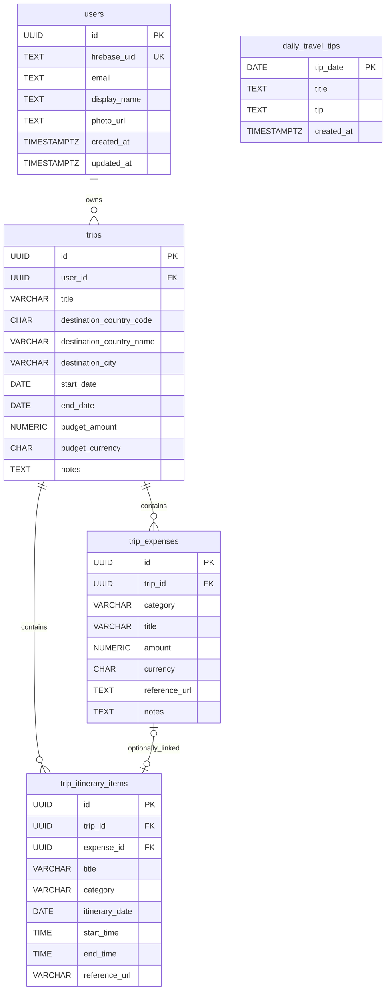

# Travel Planner — Data Model

## 1. Overview

Travel Planner stores persistent application data in PostgreSQL hosted by Supabase. The ASP.NET Core backend accesses the database through Npgsql and parameterized, handwritten SQL rather than an ORM.

The current schema contains five application tables:

- `users`
- `trips`
- `trip_expenses`
- `trip_itinerary_items`
- `daily_travel_tips`

The first four tables form the user-owned travel domain. `daily_travel_tips` is independent shared content used by the daily AI-tip feature.

## 2. Entity Relationship Diagram

Every trip belongs to one user, and every expense or itinerary item belongs to one trip. An itinerary item may optionally reference one expense. A partial unique index on non-null `expense_id` values prevents an expense from being linked to more than one itinerary item, making the link optional one-to-one in both directions. `daily_travel_tips` has no foreign-key relationship to the user-owned tables.

## 3. `users`

The `users` table maps external Firebase identities to local application users.

| Field | Database type | Purpose |
|---|---|---|
| `id` | `UUID` | Primary key generated with `gen_random_uuid()`. This is the application's ownership identifier. |
| `firebase_uid` | `TEXT` | Required unique Firebase user identifier. |
| `email` | `TEXT` | Required email copied from the verified Firebase identity during synchronization. |
| `display_name` | `TEXT` | Optional display name. |
| `photo_url` | `TEXT` | Optional profile image URL. |
| `created_at` | `TIMESTAMPTZ` | Creation timestamp, defaulting to the current time. |
| `updated_at` | `TIMESTAMPTZ` | Last-update timestamp maintained by a database trigger. |

Firebase UID is the stable mapping from Firebase Authentication to the local user record. Once resolved, `users.id`—not the Firebase UID—is used to scope application data.

## 4. `trips`

The `trips` table stores the core user-owned travel plan.

| Field | Database type | Purpose |
|---|---|---|
| `id` | `UUID` | Primary key generated with `gen_random_uuid()`. |
| `user_id` | `UUID` | Required foreign key to `users.id`; defines trip ownership. |
| `title` | `VARCHAR(100)` | Required trip title. |
| `destination_country_code` | `CHAR(2)` | Required two-character destination country code. |
| `destination_country_name` | `VARCHAR(100)` | Required destination country name. |
| `destination_city` | `VARCHAR(100)` | Required destination city. |
| `start_date` | `DATE` | Required trip start date. |
| `end_date` | `DATE` | Required trip end date; cannot precede `start_date`. |
| `budget_amount` | `NUMERIC(12,2)` | Optional non-negative trip budget. |
| `budget_currency` | `CHAR(3)` | Required budget currency, defaulting to `ILS`. |
| `notes` | `TEXT` | Optional trip notes, limited to 10,000 characters. |
| `notes_updated_at` | `TIMESTAMPTZ` | Optional timestamp recording when notes were updated. |
| `created_at` | `TIMESTAMPTZ` | Creation timestamp, defaulting to the current time. |
| `updated_at` | `TIMESTAMPTZ` | Last-update timestamp maintained by a database trigger. |

Deleting a user cascades to that user's trips. Backend queries additionally use `user_id` to enforce application-level ownership when reading or changing trips.

## 5. `trip_expenses`

The `trip_expenses` table stores paid entries belonging to a trip.

| Field | Database type | Purpose |
|---|---|---|
| `id` | `UUID` | Primary key generated with `gen_random_uuid()`. |
| `trip_id` | `UUID` | Required foreign key to `trips.id`. |
| `category` | `VARCHAR(50)` | Required nonblank expense category. |
| `title` | `VARCHAR(100)` | Required nonblank expense title. |
| `amount` | `NUMERIC(12,2)` | Required amount greater than zero. |
| `currency` | `CHAR(3)` | Required three-letter uppercase currency code. |
| `reference_url` | `TEXT` | Optional reference URL, limited to 2,048 characters. |
| `notes` | `TEXT` | Optional notes, limited to 2,000 characters. |
| `created_at` | `TIMESTAMPTZ` | Creation timestamp, defaulting to the current time. |
| `updated_at` | `TIMESTAMPTZ` | Last-update timestamp maintained by a database trigger. |

Deleting a trip cascades to its expenses. Expense ownership is derived through the owning trip rather than through a separate user column.

## 6. `trip_itinerary_items`

The `trip_itinerary_items` table stores trip activities, including both scheduled and unscheduled entries.

| Field | Database type | Purpose |
|---|---|---|
| `id` | `UUID` | Primary key generated with `gen_random_uuid()`. |
| `trip_id` | `UUID` | Required foreign key to `trips.id`. |
| `expense_id` | `UUID` | Optional foreign key to `trip_expenses.id`. |
| `title` | `VARCHAR(100)` | Required nonblank activity title. |
| `description` | `VARCHAR(2000)` | Optional activity description. |
| `category` | `VARCHAR(50)` | Required nonblank activity category. |
| `itinerary_date` | `DATE` | Optional scheduled date. |
| `start_time` | `TIME` | Optional start time; present only as part of a start/end pair. |
| `end_time` | `TIME` | Optional end time; must be later than `start_time` when supplied. |
| `reference_url` | `VARCHAR(2048)` | Optional reference URL. |
| `created_at` | `TIMESTAMPTZ` | Creation timestamp, defaulting to the current time. |
| `updated_at` | `TIMESTAMPTZ` | Last-update timestamp maintained by a database trigger. |

An item with an `itinerary_date` and optional paired times is scheduled. An item with no date and no times is unscheduled. The schema prevents times from being stored without a date and requires start and end times to be either both null or both present.

Deleting a trip cascades to its itinerary items. Deleting a linked expense does not delete the itinerary item; the foreign key uses `ON DELETE SET NULL`.

## 7. Expense ↔ Itinerary Relationship

An itinerary item may reference an expense through the nullable `trip_itinerary_items.expense_id` column. The partial unique index `ux_trip_itinerary_items_expense_id` applies only when `expense_id` is non-null, so one expense cannot be referenced by multiple itinerary items. The result is an optional one-to-one link: an expense may have no linked itinerary item, and an itinerary item may have no linked expense.

Backend business services coordinate the lifecycle of linked records:

- A **free activity** has an itinerary item without an expense link.
- A **paid activity** has an itinerary item linked to an expense.
- A **free → paid** transition creates and links an expense.
- A **paid → free** transition removes the expense relationship while retaining the activity.
- A **paid → paid** edit keeps the itinerary item and linked expense synchronized.

Linked updates, transitions, and deletions that span both tables are executed through explicit PostgreSQL transactions.

## 8. `daily_travel_tips`

The `daily_travel_tips` table stores shared AI-generated travel-tip content independently from individual users and trips.

| Field | Database type | Purpose |
|---|---|---|
| `tip_date` | `DATE` | Primary key; ensures at most one stored tip per date. |
| `title` | `TEXT` | Required nonblank title between 1 and 80 trimmed characters. |
| `tip` | `TEXT` | Required nonblank tip text between 1 and 300 trimmed characters. |
| `created_at` | `TIMESTAMPTZ` | Creation timestamp, defaulting to the current time. |

Persisting generated tips allows the backend to reuse a daily result across requests and process restarts. Stored older data can also serve as a fallback when a current tip cannot be generated or retrieved. This table has no `updated_at` column or update trigger.

## 9. Constraints and Integrity

The schema enforces the following material integrity rules:

- **Foreign-key ownership:** `trips.user_id` references `users.id`; expense and itinerary `trip_id` values reference `trips.id`; itinerary `expense_id` references `trip_expenses.id`.
- **Cascade behavior:** deleting a user deletes owned trips, and deleting a trip deletes its expenses and itinerary items. Deleting an expense sets a linked itinerary item's `expense_id` to null.
- **Trip dates and budget:** `end_date` cannot precede `start_date`; an optional `budget_amount` cannot be negative.
- **Expense values:** expense amount must be positive, currency must match three uppercase letters, and category and title cannot be blank after trimming.
- **Itinerary scheduling:** start and end times must be supplied together; the end must be later than the start; times cannot exist without an itinerary date.
- **Text limits:** trip notes are limited to 10,000 characters; expense notes and reference URLs are limited to 2,000 and 2,048 characters respectively. Itinerary description and URL sizes are bounded by their `VARCHAR` types.
- **Daily-tip content:** trimmed titles and tips must stay within their defined nonblank length ranges.
- **Linked-record uniqueness:** a partial unique index permits each non-null expense ID to appear in at most one itinerary item.
- **Timestamps:** `created_at` values default to the current time. A shared trigger function updates `updated_at` before updates to users, trips, expenses, and itinerary items.

## 10. Indexes

Indexes support the application's main ownership and destination access paths:

- `trips.user_id` supports retrieving the authenticated user's trips.
- Trip country code and city indexes support destination-based access.
- Expense and itinerary `trip_id` indexes support loading child records for a trip.
- Composite itinerary indexes on `(trip_id, itinerary_date)` and `(trip_id, itinerary_date, start_time)` support date-grouped and ordered schedule access.
- The partial unique itinerary `expense_id` index enforces the optional one-to-one expense link as well as supporting linked-record lookup.

Primary-key and unique constraints also create the corresponding PostgreSQL uniqueness indexes, including the unique Firebase UID and daily tip date.

## 11. Row-Level Security

Row-level security is enabled on all five application tables. The schema file currently defines no RLS policies.

User ownership is presently enforced at the application layer through Firebase-to-local-user resolution, user-scoped backend services, and SQL that filters by the local user's UUID or by an owned trip. RLS must not be treated as an independent ownership boundary in this schema as written. Actual database behavior also depends on the PostgreSQL role used by the backend connection and whether that role bypasses RLS or is otherwise permitted to access the tables.

## 12. Persistence Characteristics

- PostgreSQL hosted on Supabase.
- UUID identifiers generated with PostgreSQL `pgcrypto`.
- Explicit foreign-key ownership and cascade rules.
- Npgsql with parameterized, handwritten SQL.
- Transactional itinerary and expense workflows.
- Persistent AI-generated daily tips.
- No ORM.
- No migration framework currently in use; the repository maintains the schema as SQL in `Backend/Database/schema.sql`.
