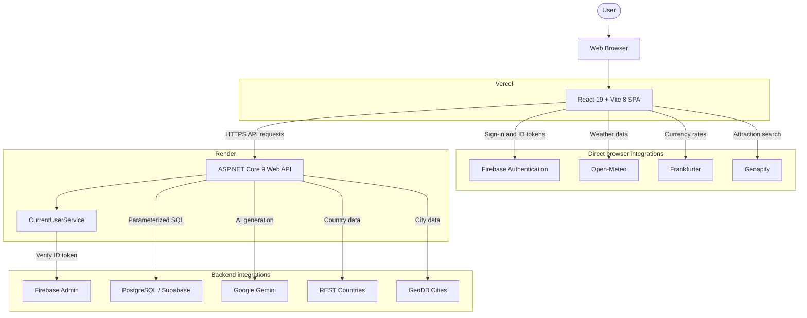

# Travel Planner — System Architecture

## 1. Architecture Overview

Travel Planner is a production-deployed full-stack single-page application. Its frontend is built with React 19 and Vite 8 and deployed on Vercel. Its backend is an ASP.NET Core 9 Web API deployed as a Docker container on Render. Application data is stored in PostgreSQL on Supabase, while Firebase provides user authentication.

The application also integrates Google Gemini for AI-assisted features and several travel and public-data providers. Integrations are deliberately split between the browser and backend according to the current implementation.

## 2. System Architecture Diagram



Open-Meteo, Frankfurter, and Geoapify are called directly by the browser. REST Countries, GeoDB, Gemini, Firebase Admin, and PostgreSQL are accessed by the backend.

## 3. Frontend Architecture

The frontend follows a feature-oriented flow:

```text
Pages → feature hooks → services/request managers → backend or external provider
      → cache reconciliation → presentation components
```

Pages assemble feature behavior and presentation rather than containing all request and state logic themselves. Feature hooks coordinate workflows such as trip creation, trip details, itinerary management, expenses, attractions, destination selection, weather, and currency conversion. Services and request managers isolate HTTP calls, cache access, request sharing, cancellation, and response normalization. Components are organized by feature and reusable presentation responsibility.

Application-wide state is provided by:

- `AuthProvider`, which manages Firebase session restoration, token changes, backend user synchronization, and logout cleanup.
- `TripsProvider`, which manages user-scoped trip state and coordinates trip cache updates.
- `FeedbackProvider`, which provides application feedback messages.

Routes are lazy-loaded with React `lazy` and `Suspense`. Authenticated application routes are wrapped by `ProtectedRoute`, while login and registration remain outside the protected layout.

The frontend uses in-memory, `localStorage`, and `sessionStorage` caches according to the lifetime and sensitivity of each dataset. Request managers and feature hooks use request deduplication, `AbortController`, session or generation identifiers, and stale-response guards to prevent obsolete responses from replacing newer state. Itinerary scheduling also uses optimistic updates with reconciliation against confirmed backend state.

## 4. Backend Architecture

The backend follows a pragmatic layered structure:

```text
Controllers → Services → Data Access Layer → PostgreSQL
```

- **Controllers** handle routing, HTTP request and response concerns, request validation results, authentication checks, and status-code mapping.
- **Services** implement business workflows, external-provider coordination, AI operations, ownership-aware orchestration, and multi-step transactional behavior.
- **Data access services** use Npgsql with parameterized, handwritten SQL to query and mutate PostgreSQL.
- **DTOs** define API request and response contracts and provide validation through data annotations and custom validation rules.
- **Models** represent application records shaped around persisted database data.

The backend intentionally uses direct Npgsql access rather than Entity Framework. It does not use a repository framework, MediatR, or AutoMapper.

## 5. Authentication and User Ownership

Authentication currently works as follows:

1. The user signs in through Firebase Authentication in the browser.
2. React receives a Firebase ID token.
3. React sends the token to `POST /api/Auth/login`, where the backend verifies it and creates or updates the corresponding local user.
4. Protected frontend requests include `Authorization: Bearer <token>`.
5. `CurrentUserService` extracts the Bearer token and verifies it through Firebase Admin.
6. The verified Firebase UID is mapped to a record in the local `users` table.
7. The local `AppUser.Id` is passed to user-scoped database operations.

The current backend performs this verification explicitly through `CurrentUserService`; it does not currently use ASP.NET Core authentication middleware or `[Authorize]` attributes. Database queries and business services scope trip, itinerary, and expense operations to the resolved local user, preventing access to another user's records.

## 6. Data and Persistence

The PostgreSQL schema contains five application tables:

- `users` stores the local application identity mapped to a unique Firebase UID.
- `trips` stores user-owned destinations, travel dates, budgets, and notes.
- `trip_expenses` stores expenses belonging to a trip.
- `trip_itinerary_items` stores scheduled or unscheduled trip activities.
- `daily_travel_tips` stores generated tips by date.

The principal relationships are:

```text
users 1 ──→ many trips
trips 1 ──→ many trip_expenses
trips 1 ──→ many trip_itinerary_items
trip_expenses 1 ──→ optional 1 trip_itinerary_item
```

Expense and itinerary records can be linked through the itinerary item's optional expense reference. Creation, updates, transitions, and deletion workflows that affect both records are synchronized within PostgreSQL transactions so the two representations remain consistent.

## 7. External Services

| Service | Accessed by | Purpose |
|---|---|---|
| Firebase Authentication | Browser | Google and email/password sign-in, client session management, and ID-token issuance. |
| Firebase Admin | Backend | Firebase ID-token verification and trusted UID extraction. |
| Supabase/PostgreSQL | Backend | Persistent application data and transactional storage. |
| Google Gemini | Backend | Trip-note organization and daily travel-tip generation. |
| REST Countries | Backend | Country metadata used by destination selection and display. |
| GeoDB Cities | Backend | Major-city lists and city-prefix search. |
| Open-Meteo | Browser | Forecast and historical weather data. |
| Frankfurter | Browser | Currency exchange rates and conversion. |
| Geoapify | Browser | Attraction categories and nearby place search. |
| Google Maps / Waze | Browser | Outbound map and navigation links for attractions. |

## 8. Caching and Request Coordination

The frontend combines in-memory caches with `localStorage` and `sessionStorage`. Private trip, itinerary, expense, and attraction data is scoped by user where applicable. Request managers share in-flight work to avoid duplicate calls, use `AbortController` for cancellation, and guard state updates against stale sessions or responses. Cache reconciliation keeps trip, itinerary, and expense views consistent after mutations, while itinerary schedule changes are applied optimistically and reconciled with the server result.

The backend uses `IMemoryCache` for reusable provider data, shares selected in-flight requests, and serializes or paces GeoDB requests to respect the provider's free-service limits. Daily AI tips use both persistent PostgreSQL storage and an in-memory cache so a generated daily result can be reused. Backend memory caches are instance-local and are cleared when the Render process restarts or another instance handles the request.

## 9. Deployment Architecture

- **Frontend:** React/Vite production build deployed to Vercel, with SPA route rewriting to `index.html`.
- **Backend:** ASP.NET Core 9 published into a multi-stage Docker image and deployed to Render.
- **Database:** PostgreSQL hosted by Supabase.
- **Authentication:** Firebase Authentication in the browser with Firebase Admin verification in the backend.

Frontend `VITE_*` environment variables are build-time browser configuration and are embedded into the delivered client bundle. They must not be treated as private server secrets; browser-visible provider keys require the appropriate provider-side origin or referrer restrictions.

Backend secrets are supplied through ASP.NET Core configuration and environment variables. Database credentials, Gemini credentials, and Firebase Admin configuration remain server-side. The Firebase Admin credential file and its configured path remain outside source control.

## 10. Key Architectural Characteristics

- Stateless HTTP API.
- Firebase-based identity with local user mapping.
- User-scoped ownership for trips, itinerary items, and expenses.
- Layered ASP.NET Core backend with explicit service and data-access responsibilities.
- Feature-oriented React frontend with context-backed shared state.
- Direct browser integrations for public weather, currency, and attraction providers.
- Transactional itinerary and expense workflows.
- Multi-level browser, process-memory, and persistent caching.
- Production deployment on managed cloud services through Vercel, Render, Supabase, and Firebase.
